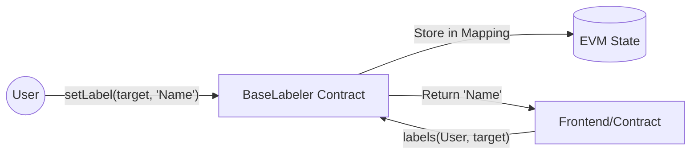

# Base Labeler

A minimalist, on-chain address book for the Base ecosystem.
**No off-chain databases. No centralized APIs. 100% sovereign metadata.**

> "Simplicity is the ultimate sophistication."

---

## The Problem

Blockchain explorers and wallets often use centralized databases to label addresses. 
**Critique:** If the provider censors a label or goes offline, your context is lost. Metadata should be as permanent and sovereign as the assets themselves.

## The Solution: On-Chain Registry

I built a minimalist registry that allows users to store and manage their own address labels directly inside the EVM. 

1. **Self-Sovereign:** You own your labels. No one can edit or delete them but you.
2. **Context Isolation:** Labels are stored in a nested mapping, ensuring your personal address book doesn't clutter the global namespace.

> **Efficiency:** Storing strings on-chain is often criticized for cost. On Base (L2), this cost is negligible (~$0.01), while the benefit of permanent, available metadata is absolute.

---

## Architecture

We reject complex registry patterns in favor of a single, flat mapping for maximum gas efficiency.



---

## Design Philosophy (First Principles)

### 1. Privacy through Mapping Logic

Instead of a global public directory, the contract uses a double-mapping. This ensures that your label for a specific address is only linked to *your* identity.

```solidity
// owner => target address => label string
mapping(address => mapping(address => string)) public labels;

```

### 2. Zero-Dependency Core

The contract is written in raw Solidity 0.8.26.

* **No OpenZeppelin:** We don't need `Ownable` or `AccessControl` for a single mapping.
* **Minimalist Events:** We only emit what is necessary for subgraph indexing.

### 3. Gas Optimization

By using `calldata` for string inputs and avoiding complex storage structures, we keep the `setLabel` transaction cost to the absolute minimum required by the EVM.

---

## Tech Stack

* **Contracts:** Solidity 0.8.26, Foundry (Forge)
* **Chain:** Base Mainnet

## Integration

To pull labels into your own contract or frontend:

```solidity
function getLabel(address owner, address target) external view returns (string memory) {
    return BaseLabeler(contractAddress).labels(owner, target);
}

```

---

## Run Locally

### 1. Contracts (Foundry)

```bash
# Install dependencies
forge install

# Run tests
forge test -vv

```

---

## License

This project is open source and available under the [MIT License](https://opensource.org/licenses/MIT).

### Author

Built with 💙 on Base by [Roman](https://www.linkedin.com/in/tilmatochek/).
**Хочешь, чтобы я подготовил такой же README для твоего первого модуля — Sovereign Switch?** Это окончательно приведет твое портфолио к единому "Джордж-стайлу".

```
